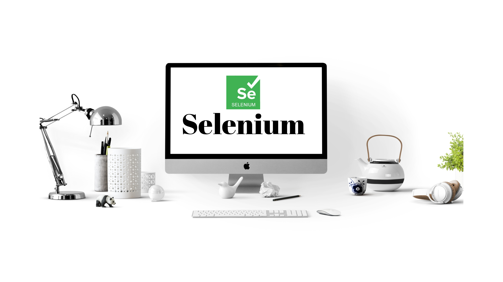

# About The Book

This book is sincere effort to put all the basic knowledge about

* Selenium
* How to use selenium
* How to develop a automation framework


**Please help in improving the quality of the book by sharing your valuable feedback, suggestions, correction or by saying what can be added more.  
  
Please share your feedback** [**here**](https://docs.google.com/forms/d/e/1FAIpQLSedtN2iXroNC5N8UOyJs_HyFe0oJsBU5PPoSZvTm-eQWjAadA/viewform?usp=sf_link)\*\*\*\*



This book is currently in progress, lot of sections might be empty or half done. But they'll be finished soon.


