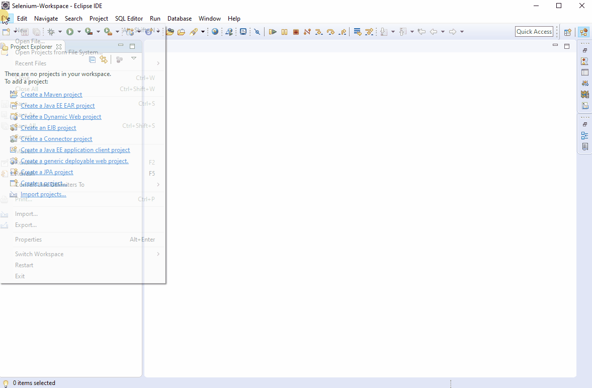
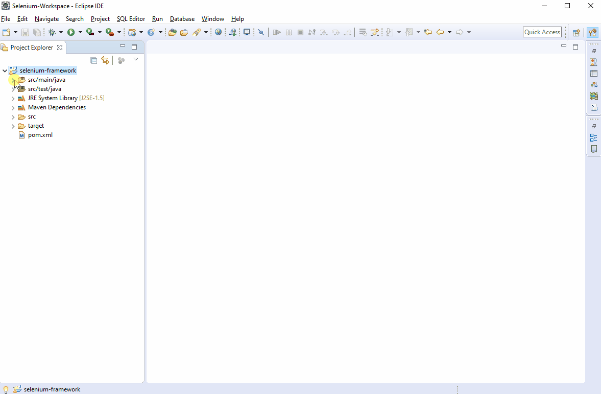
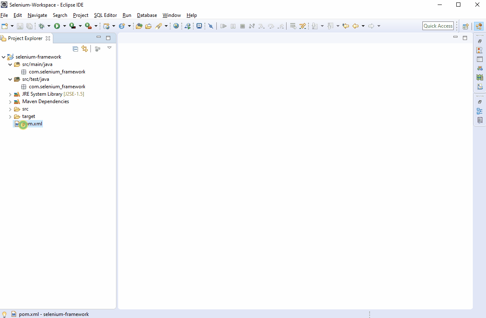

# Setup

#### 1. Creating a maven project



#### 2. Delete previously generated classes.



#### 3. Adding required dependencies

For our framework, we need following dependencies.

```markup
<!-- https://mvnrepository.com/artifact/org.seleniumhq.selenium/selenium-java -->
<dependency>
	<groupId>org.seleniumhq.selenium</groupId>
	<artifactId>selenium-java</artifactId>
	<version>3.141.59</version>
</dependency>


<!-- https://mvnrepository.com/artifact/org.testng/testng -->
<dependency>
	<groupId>org.testng</groupId>
	<artifactId>testng</artifactId>
	<version>6.14.3</version>
	<scope>test</scope>
</dependency>


<!-- https://mvnrepository.com/artifact/com.relevantcodes/extentreports -->
<dependency>
	<groupId>com.relevantcodes</groupId>
	<artifactId>extentreports</artifactId>
	<version>2.41.2</version>
</dependency>


<!-- https://mvnrepository.com/artifact/log4j/log4j -->
<dependency>
	<groupId>log4j</groupId>
	<artifactId>log4j</artifactId>
	<version>1.2.17</version>
</dependency>


<!-- https://mvnrepository.com/artifact/org.simplejavamail/simple-java-mail -->
<dependency>
	<groupId>org.simplejavamail</groupId>
	<artifactId>simple-java-mail</artifactId>
	<version>5.1.1</version>
</dependency>
```

We'll talk about these dependencies and why they are required in the upcoming sections.



#### 4. Changing maven settings

Maven defaults to Java 1.5 compiler and JVM to to all new projects. We should change that to Java 8. In order to do that, edit the properties section in the pom.xml as shown below

```markup
<properties>
		<project.build.sourceEncoding>UTF-8</project.build.sourceEncoding>
		<maven.compiler.source>1.8</maven.compiler.source>
		<maven.compiler.target>1.8</maven.compiler.target>
</properties>
```

 And update the project.

`Right click on project -> Maven -> Update Project`

