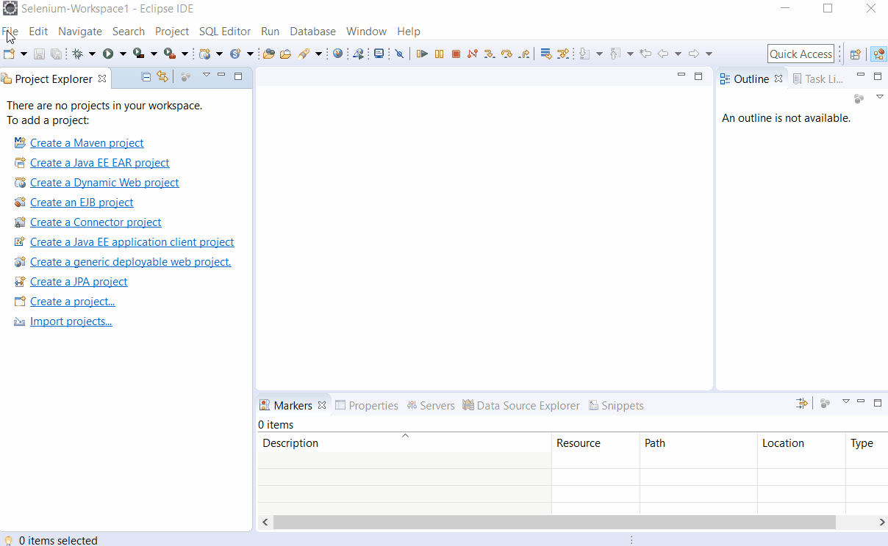
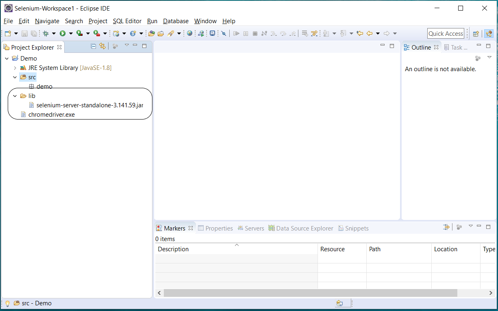
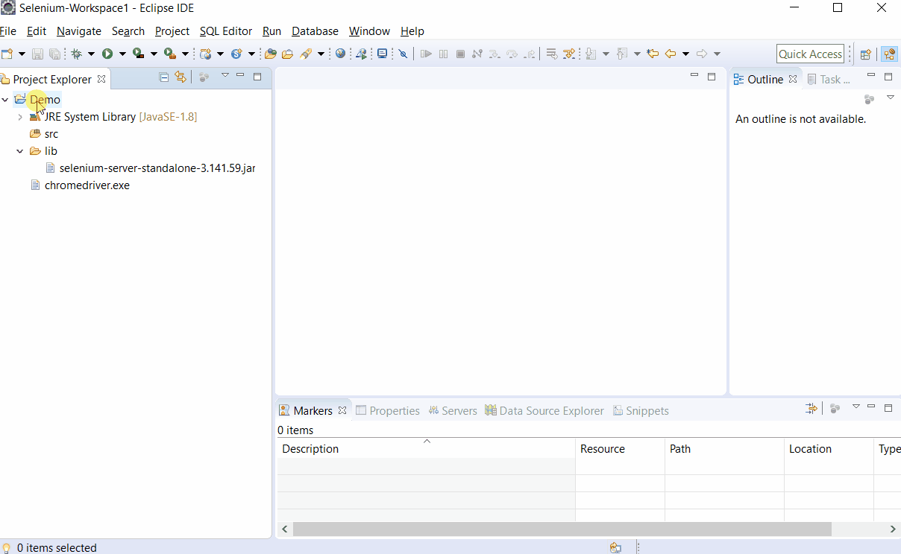
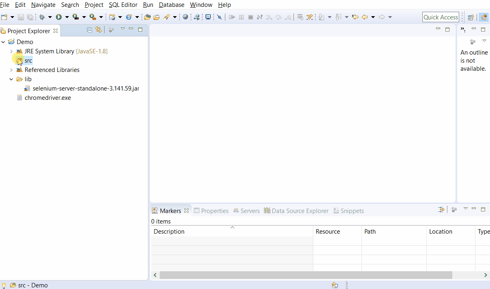

# Getting Started - Hello World..!!

1. Create a project in eclipse.  



2.  Create a folder named \(lib\) in the project and place downloaded **selenium jar** file there

3. Add selenium jar to project build path.

4. Place the downloaded chromedriver in the project folder.






5. Create Helloworld class and paste the following code.

```java
import org.openqa.selenium.By;
import org.openqa.selenium.Keys;
import org.openqa.selenium.WebDriver;
import org.openqa.selenium.WebElement;
import org.openqa.selenium.chrome.ChromeDriver;

public class HelloWorld {
	public static void main(String... args) {
		WebDriver driver = new ChromeDriver();
		driver.get("https://www.google.com/");
		WebElement searchInput = driver.findElement(By.name("q"));
		searchInput.sendKeys("Hello World..." + Keys.ENTER);
		driver.close();
		driver.quit();
	}
}
```



## **Hello World Explained**

Now let’s see what’s happening in these 3 lines of code.

In the world of Java everything is object. And every object is an instance of a class which defines the objects behaviour and state.

Now in this example we are basically using 2 of such major objects.

1. **WebDriver**
2. **WebElement**

**WebDriver:** Is the object representation of our browser. Let it be Chrome, Firefox, Safari etc.,

1. WebDriver is an Interface in selenium library, implementation of which comes from different vendors like GoogleChrome, Firefox, Safari etc.,
2. These implementation are concrete in nature and contain the implementation for interaction methods which are defined in WebDriver interface.

For example:

```java
WebDriver driver = new ChromeDriver();
driver.get("https://www.google.com/");
```

Here get is a method defined in WebDriver interface which navigates to the specified url. Here the implementation is coming from ChromeDriver class which has implementation of get method.

**WebElement:** Is the object representation of each element present inside the browser. All the links, buttons, forms, form inputs, images, basically anything in the browser can be a WebElement.

In our example we’ve now explicitly mentioned it but we are using it. The third line can be written like this also  


```java
WebElement searchInput = driver.findElement(By.name("q"));
searchInput.sendKeys("Hello World..." + Keys.ENTER);
```

The line

```java
WebElement searchInput = driver.findElement(By.name("q"));
```

Creates a WebElement object which represents the search input. And it has all the methods that a user wants to perform on a web element. Like click, sendkeys \(typing\), getting value of it etc

Finally 

```java
driver.close();
driver.quit();
```

driver.close\(\) closes the current working window. And driver.quit\(\) closes all open windows of that particular browser.

> **Congrats you first selenium script is running.** 😊

