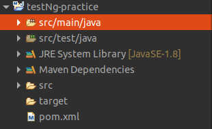

# TestNG Setup

### Prerequisite:

1. Java8 installed.
2. Maven installed.

#### 1. Eclipse Editor

1. Download eclipse from [here](https://www.eclipse.org/downloads/packages/release/2020-06/r). Note: Do not install package more than 2020-06 as they are not compatible with Java 8.
2. After downloading eclipse, download TestNG plugin from update site [`https://dl.bintray.com/testng-team/testng-eclipse-release/`](https://dl.bintray.com/testng-team/testng-eclipse-release/)  `Help > Install New Software > and paste the above URL` 

#### 2. Create New Maven project.

#### 3. Add TestNG dependency.

```text
<!-- https://mvnrepository.com/artifact/org.testng/testng -->
<dependency>
    <groupId>org.testng</groupId>
    <artifactId>testng</artifactId>
    <version>7.3.0</version>
    <scope>test</scope>
</dependency>
```

Once after the setup your editor should look something like this with no errors \(If you are using eclipse\).



That's  it. We can start using TestNG.

